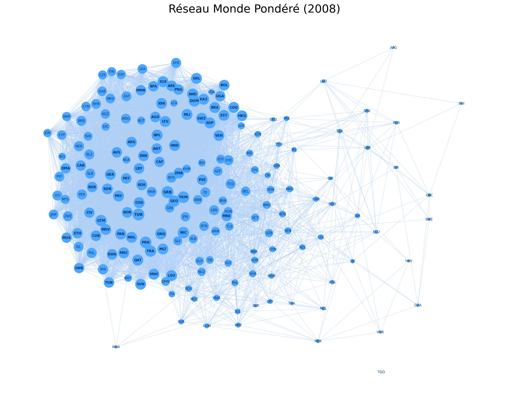
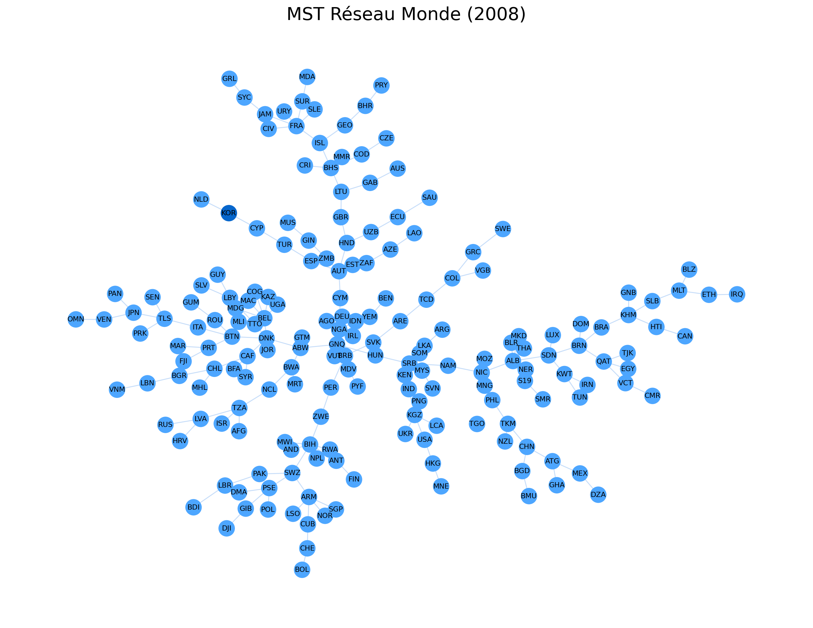
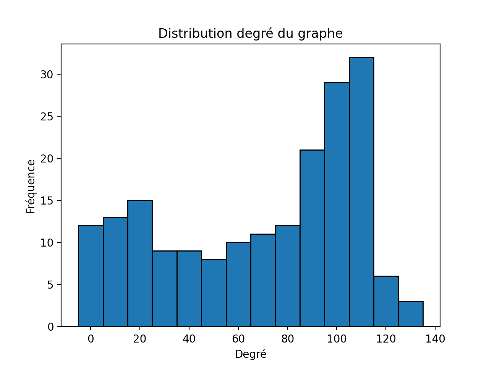
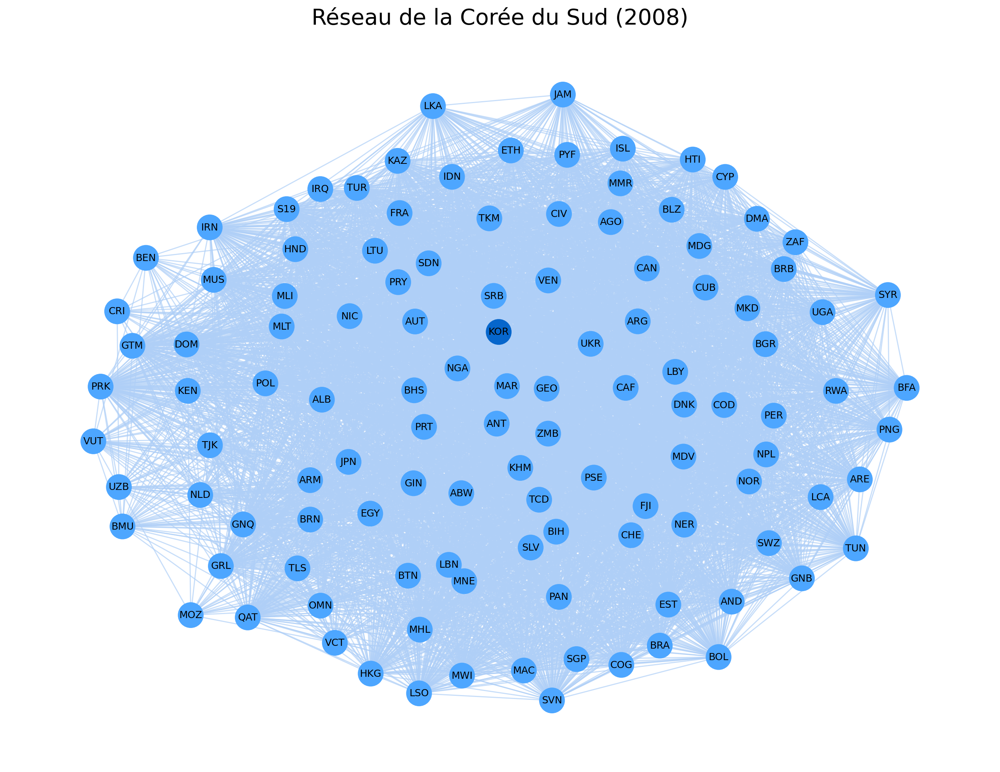

# Analyse de réseaux — Country Space (2008 vs 1998)

> **English summary** — Social network analysis of the *Country Space* (a country-similarity network built from export product baskets — economic-complexity data). Built with Python / NetworkX for a graduate "Network Analysis" course. Covers descriptive network statistics, degree/strength distributions, four centrality measures, small-world index (Neal, 2017), a Louvain community detection, a robustness analysis via the Fiedler value and minimum spanning tree, a **MRQAP** regression comparing the 2008 and 1998 networks, and a deep-dive on South Korea's position in the network. See the [full notebook](notebooks/network-analysis-country-space.ipynb) and the [key results](#résultats-clés) below.

Projet réalisé dans le cadre d'un devoir universitaire d'**Analyse de réseaux** (Master). L'énoncé ([docs/Devoir Analyse de Réseau.pdf](<docs/Devoir Analyse de Réseau.pdf>)) demandait d'étudier le réseau attribué dans son ensemble, puis la position d'un pays donné (ici la **Corée du Sud**) au sein de ce réseau — ce README et le notebook suivent cette même structure en deux parties.

## Sommaire

- [Le jeu de données](#le-jeu-de-données)
- [Méthodologie](#méthodologie)
- [Résultats clés](#résultats-clés)
- [Focus : la Corée du Sud](#focus--la-corée-du-sud)
- [Aperçus visuels](#aperçus-visuels)
- [Stack technique](#stack-technique)
- [Reproduire l'analyse](#reproduire-lanalyse)
- [Structure du dépôt](#structure-du-dépôt)
- [Limites et pistes d'amélioration](#limites-et-pistes-damélioration)
- [Sources](#sources)

## Le jeu de données

Le **Country Space** est un réseau de similarité entre pays, construit à partir de la proximité de leurs paniers de produits exportés (dans l'esprit de l'*Atlas of Economic Complexity* — le poids d'un lien entre deux pays est d'autant plus élevé que leurs exportations se ressemblent). Les données sont dérivées de la base **BACI** (CEPII) et fournies sous forme de matrices carrées, symétriques, à diagonale nulle (réseau non orienté, pas d'auto-boucle) :

- [`data/Country_Space_2008.csv`](data/Country_Space_2008.csv) — 190 pays
- [`data/Country_Space_1998.csv`](data/Country_Space_1998.csv) — 167 pays

## Méthodologie

**I — Analyse du réseau mondial (2008)**
1. Chargement et mise en forme des matrices (pandas → graphe NetworkX)
2. Description structurelle : nœuds, arêtes, densité, composantes connexes, diamètre, rayon, centre/périphérie
3. Distributions du degré et de la force (histogramme, classement, échelle log-log)
4. Centralisation du réseau (concentration autour de quelques nœuds vs réseau dispersé)
5. Acteurs centraux et périphériques : centralité de degré, proximité (closeness), intermédiarité (betweenness), vecteur propre (eigenvector), charge (load)
6. Test de propriété "petit-monde" via le **Small-World Index** de Neal (2017)
7. Comparaison structurelle avec le réseau **10 ans plus tôt (1998)**, y compris une régression **MRQAP** (Multiple Regression Quadratic Assignment Procedure — approche manuelle par permutations puis via la librairie [mrqap-python](https://github.com/lisette-espin/mrqap-python))
8. Robustesse du réseau via la **valeur de Fiedler** (connectivité algébrique, 2ᵉ valeur propre du Laplacien) et son **arbre couvrant minimal**

**II — Position d'un pays : la Corée du Sud**
1. La Corée est-elle un acteur central du réseau ?
2. Ses principaux voisins (les pays au panier d'exportations le plus proche)
3. Le cluster (communauté, détection de Louvain) auquel elle appartient
4. Sa distance (plus court chemin pondéré) jusqu'aux États-Unis

## Résultats clés

**Réseau mondial (2008)**
- **190 nœuds, 7 006 arêtes**, densité = 0,39 → réseau dense
- Non connexe : **2 composantes**, composante géante de diamètre 4 / rayon 3
- **Small-World Index (Neal, 2017) = 0,27**, coefficient de clustering = 0,69, distance moyenne = 1,75 → le réseau présente des caractéristiques **petit-monde** marquées (clustering très élevé pour un chemin moyen très court)
- Acteurs les plus centraux (degré) : Serbie, Turquie, Turkménistan, Corée du Nord — des économies aux exportations "génériques", proches de nombreux autres paniers de produits
- **Robustesse fragile** : valeur de Fiedler = 0 sur le graphe complet (réseau non connexe ⇒ facilement "déconnectable"), mais λ₂ ≈ 0,26 sur la composante géante seule
- **MRQAP 2008 ~ 1998** : coefficient positif et significatif (β = 0,091, p < 0,01) mais **R² = 0,009** → la structure du réseau de 1998 n'explique qu'une part marginale de celle de 2008, signe d'une **forte recomposition du commerce mondial en 10 ans**

## Focus : la Corée du Sud

- Centralité de la Corée par rapport aux autres pays (percentile, plus la valeur est basse plus le pays est central) : **proximité — top 7 %**, **degré — top 11 %**, vecteur propre — top 22 %, charge — top 26 %, intermédiarité — top 26 % → un acteur **bien inséré et rapidement joignable**, mais qui joue moins un rôle de "pont" entre pays éloignés
- Ses voisins les plus proches en structure d'exportation (poids de similarité) : Bahamas, Mali, Eswatini, îles Marshall, Turkménistan...
- Elle appartient à la plus grande communauté détectée par Louvain (**91 pays sur 190**), regroupant des économies aux profils d'exportation diversifiés
- Distance pondérée jusqu'aux États-Unis : **2 sauts** (Corée → Géorgie → États-Unis), longueur cumulée ≈ 1,66

## Aperçus visuels

| Réseau mondial 2008 (pondéré) | Corée du Sud en évidence, arbre couvrant minimal |
|---|---|
|  |  |

| Distribution des degrés | Réseau de la Corée (voisinage) |
|---|---|
|  |  |

## Stack technique

- **Python** — `pandas`, `numpy` (manipulation des matrices/données)
- **NetworkX** — construction des graphes, centralités, plus courts chemins, Laplacien, MST
- **python-louvain** — détection de communautés
- **statsmodels**, **scipy** — régression MRQAP, tests statistiques
- **matplotlib** — visualisations de réseau et distributions
- **mrqap-python** (vendorisé dans [`src/libs/`](src/libs), voir [Sources](#sources)) — implémentation de la régression QAP avec permutations

## Reproduire l'analyse

```bash
git clone https://github.com/Marius-cld/Network-Analysis-Country-Space-KOR.git
cd Network-Analysis
python3 -m venv .venv && source .venv/bin/activate
pip install -r requirements.txt
jupyter notebook notebooks/network-analysis-country-space.ipynb
# ou, de façon équivalente :
python src/network-analysis-country-space.py
```

Les chemins (`data/`, `figures/`, `tables/`) sont résolus depuis l'emplacement du notebook/script, quel que soit le répertoire de travail au lancement.

## Structure du dépôt

```
Network-Analysis/
├── notebooks/
│   └── network-analysis-country-space.ipynb   # Notebook principal, narratif
├── src/
│   ├── network-analysis-country-space.py      # Équivalent script de l'analyse
│   └── libs/                # Librairie mrqap-python vendorisée (régression QAP)
├── data/                    # Matrices de similarité Country Space (2008 / 1998)
├── figures/                 # Graphiques générés — quelques images clés suivies, le reste gitignoré
├── tables/                  # Tableaux de résultats générés (centralités, MRQAP, clusters...) — gitignoré
├── docs/
│   ├── Devoir Analyse de Réseau.pdf   # Énoncé du devoir
│   └── Network Analysis.pdf           # Export PDF complet du notebook exécuté
├── requirements.txt
└── LICENSE
```

## Limites et pistes d'amélioration

- Le réseau de 1998 a une couverture pays plus restreinte (167 vs 190) ; l'alignement pour le MRQAP se fait sur l'intersection des nœuds communs, ce qui limite la comparabilité stricte des deux périodes.
- Le faible R² du MRQAP mériterait d'être creusé avec des covariables supplémentaires (proximité géographique, accords commerciaux, PIB) plutôt qu'une simple auto-régression réseau-sur-réseau.

## Sources

- [Analyse de réseau avec Python et NetworkX (HAL)](https://hal.science/hal-04214044/file/Analyse-de-réseau-avec-Python-et-NetworkX.pdf)
- [mrqap-python (GitHub, CC0-1.0)](https://github.com/lisette-espin/mrqap-python)
- Neal, Z. P. (2017). *Identifying statistically significant edges in one-mode projections.* — Small-World Index
- [BACI (CEPII)](http://www.cepii.fr/CEPII/en/bdd_modele/bdd_modele_item.asp?id=37) — base de données du commerce international, à l'origine des matrices de similarité utilisées

## Licence

Code sous licence [MIT](LICENSE). Voir la licence pour l'attribution de la librairie `src/libs/` vendorisée.
